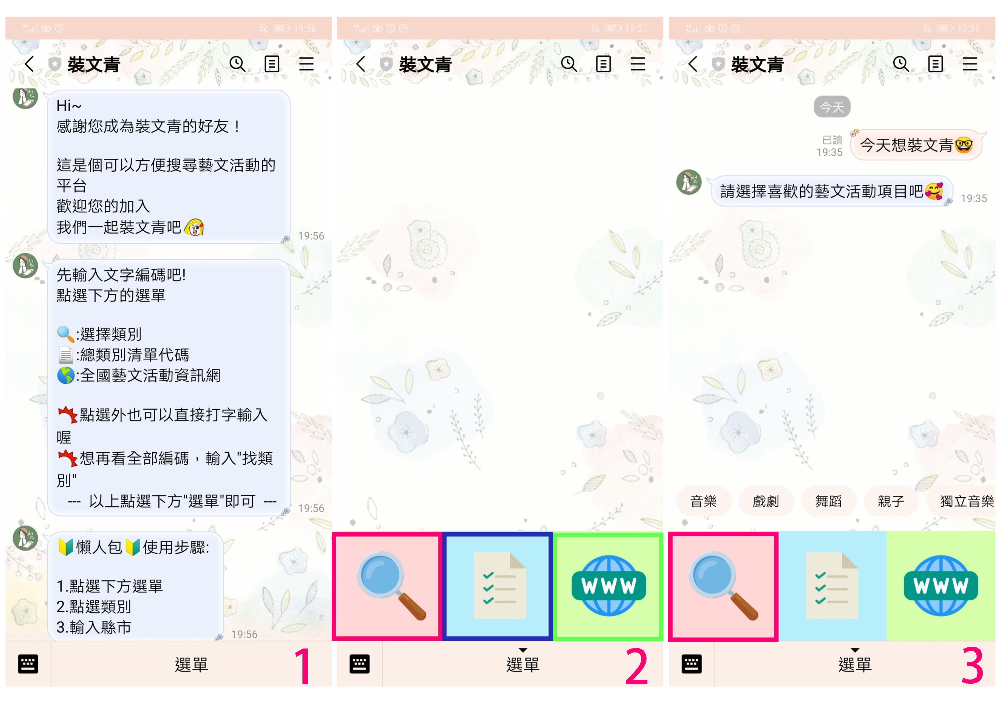
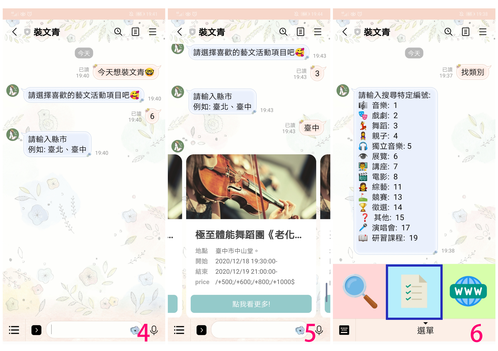

# 裝文青
### ID: @891olcmf  
[掃 QR Code 點我](./images/QR.png)

 >此帳號主要是找尋相關藝文活動資訊  
共有15個類別:音樂、戲劇、舞蹈、親子、獨立音樂、展覽、講座、電影、綜藝、競賽、徵選、其他、演唱會、研習課程，方便大家使用查詢。
 
 
 # 操作畫面
 1.加入好友畫面 > 2.各項選單介紹 > 3.點選放大鏡後效果  
 
 4.點選完後會出現對話框，並打字輸入縣市 > 5.輸入縣市後將會出現資料結果 >  6.點選中間按鈕出現各類別代碼  
 
 
  # API 1~15個類別 
https://opendata.culture.tw/frontsite/openData/detail?datasetId=302